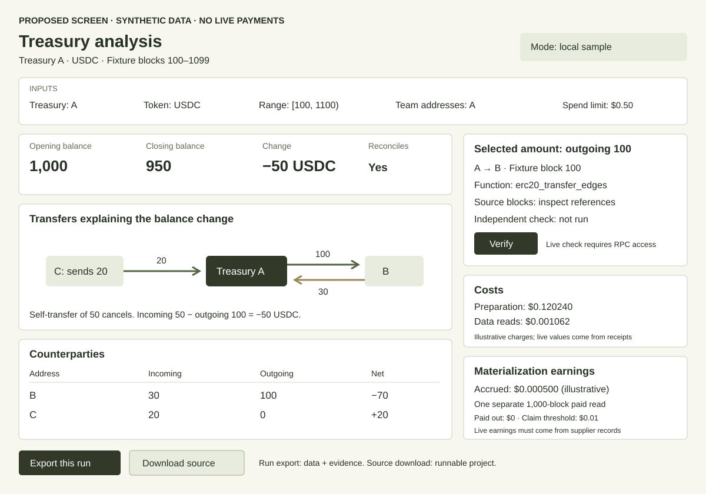

# Demo applications and downloads

**Proposed implementation · 3 October 2026**

This document describes what users will see and what developers will download. It supplements the [summary](demo-summary.md) and [implementation plan](demo-strategy.md). No runnable demos have been implemented yet.

## First-release structure

Build three independently runnable examples. Present them in a connected walkthrough from the repository index and demo website.

| Source download | Demonstrations | Visible result | Useful starting point |
| --- | --- | --- | --- |
| `sub-cent-reads` | P0 | Terminal table of activity, charges, and remaining allowance | A small budgeted paid-data client |
| `treasury-analysis` | P1, P3, supplier side of P2 | Treasury report, verification, costs, and supplier earnings | An application using paid data with reproducible calculations |
| `paid-reader` | Reader side of P2 | Purchased rows, report totals, charge, and receipt | Consuming another customer's prepared data |

This structure gives related features one useful application without requiring every developer to adopt it. The small examples remain readable independently. Some setup code may be repeated; add shared code only if the extracted downloads remain easier to understand.

P0–P3 are demonstration identifiers, not a requirement for four applications. P3 belongs in the treasury application because it verifies that report. P2 needs a separate process and payer because its purpose is to demonstrate another customer purchasing the prepared data. The walkthrough connects the examples through Testril and exported dataset references, not imports between their codebases.

## Token activity script

Accept a chain, token, prepared range, activity threshold, and spending cap. Use a documented deterministic rule to select each next range from the preceding result. Display:

```text
Range          Transfer count    Read charge    Allowance left
[first range]  [returned count]   [receipt]      [remaining funds]
[next range]   [returned count]   [receipt]      [remaining funds]

Result: threshold exceeded in [checked range]
Total read charges: [sum of receipts]
Preparation: [payer and separately recorded cost]
```

The bracketed values are proposed fields, not an executed run. Print a scoped negative result if nothing qualifies. The command writes a run export with checked ranges, raw results, receipts, and source references. It does not infer treasury flows from token-wide transfer counts.

The source archive includes the CLI, payment handling, configuration template, sample responses, and README. A developer should first change the threshold, then configure their own token and live access. The sample must exercise the same selection and reporting code as live mode while clearly identifying its synthetic payment responses.

## Treasury application



The [screen sketch](treasury-preview.svg) is illustrative. It does not represent live results, measured performance, or completed UI work.

### Inputs and report

The form accepts chain, treasury, token, `[from_block,to_block)`, optional team addresses, and spending limit. The initial case uses an ordinary token with event/balance reconciliation.

The main report shows:

- Opening and closing balances, incoming and outgoing transfers, and net change.
- A flow diagram and ranked counterparty table. Address labels come from supplied information or an identified source.
- A choice to classify transfers using the supplied team addresses. Keep the treasury's own balance reconciliation separate from consolidated team accounting.
- Separate preparation, read, and optional external-RPC/LLM costs, with receipts and remaining budget.
- A verification result and source details for the selected amount.
- Supplier coverage, expiry, accrued earnings, and payout information available from the deployment.

The synthetic example corresponds to the F01 fixture in the [function requirements](function-briefs.md): A sends 100 to B, B sends 30 to A, A sends 50 to itself, and C sends 20 to A. Give the illustrative token six decimals and encode these displayed units accordingly. A starts at 1,000 and closes at 950. External inflow is 50, outflow 100, and net change −50; the self-transfer cancels. For the screen sketch, extend the synthetic interval to `[100,1100)` with no further transfers, and use balance snapshots at 99 and 1099. The illustrative preparation charge is 1,000 edge blocks plus two balance blocks: $0.120240. The three reads total $0.001062. A separate 1,000-block edge read allocates $0.000500 to the sole eligible materializer at the observed rates. These are planned example calculations, not purchased data or actual earnings.

Selecting A and B as a team makes their transfers internal and leaves external team inflow of 20 from C. Do not compare that group movement with A's individual balance change. A consolidated opening/closing balance requires snapshots for every included address.

### Verification and earnings

Selecting a number opens contributing transfer rows, raw amounts, source blocks, function identity, and the client calculation. Verification independently reads the selected source logs/state and compares the result. Source consistency and arithmetic agreement are separate statuses. F01 returns per-block aggregates; show block references unless transaction witnesses were fetched separately and labeled.

For earnings, the treasury application remains the supplier view. Export a public dataset reference containing the bound-function identity, binding parameters, covered range, chain, and token metadata. The separate reader accepts this reference or equivalent arguments and pays for a read. The supplier application refreshes actual earnings from Testril. It must not infer reward accrual merely from a button press or an imported reader receipt.

Use separate accounts and attributable purchase records or an isolated deployment. Label sponsored traffic. Show source/data mode, payment network, and recording status visibly. Present claim availability according to the actual payout threshold and expiry rules.

### Source download and run export

The source archive contains the web application, small command-line client, pure accounting functions, verifier, fixture, configuration, and local assets. It must not depend on a hosted demo server. A local server may hold the signer; the browser never receives its private key.

The run export contains the report and its inputs, not the entire application. Keep three actions separate:

- **Verify:** execute the independent comparison and show its outcome.
- **Export this run:** download the selected report and recorded evidence.
- **Download source:** obtain the versioned runnable example.

## Independent paid reader

The reader accepts a bound-function identifier and range, or the exported public dataset reference. It works against MCP without the treasury application running and without any sibling source directory. It does not need the supplier's key, private configuration, or web server.

Print the returned data or a small derived report, actual charge, payment receipt, and relevant function/range. Save a run export. The supplier's earnings remain visible in its own account, not fabricated in the reader's output.

Provide sample and live modes. Document independent payer setup and how to select a covered range. If F01 is delayed, demonstrate this with existing transfer-volume data; a change in the underlying function must remain explicit.

## Later applications

### Vault analysis

Build `vault-analysis` after function generation works. Combine G1 and G2 in one application with:

- An editable metric definition and confirmed parameters.
- Generated function code or executable definition, version, validation results, and costs.
- A deposit-group result table for G1, or repeat-deposit table and observation cutoff for G2.
- A comparison of revised definitions and their outputs.
- Source inspection, verification, and result export.

Its source download includes the application and a small consumer that reuses a generated function. Export generated definitions separately with function identity, schema, version, runtime requirements, tests, and input references. Downloaded code is not automatically portable to a different execution environment; state what is needed to run or deploy it. Local samples explain the output but must not pretend to perform live generation.

G3 is a walkthrough combining this application with a separate reader's paid reuse. It does not require another application.

### Pool analysis and REST access

If warranted, build `pool-analysis` for P4 and `rest-gateway` for P5. Each gets its own source archive and setup. The pool result is a swap/activity and active-liquidity comparison. The gateway result is a normal authenticated HTTP response with preserved evidence, plus an explicit usage record. An example gateway is distinct from a supported production SaaS service.

## Release contents and acceptance

Each source archive must include a README with purpose, runtime version, prerequisites, copyable install/run commands, configuration, expected sample output, live funding requirements, and one suggested modification. Include pinned dependencies, a lockfile where applicable, formatter/linter configuration, required assets, and tests relevant to live behavior. Do not depend on root tooling or sibling imports.

Publish a per-example versioned archive from a release; identify its source revision. A source button downloads that maintained example rather than generating client code in response to a query. The repository index lists each example and its requirements. Provide public downloads after the repository/release is authorized for public distribution, reviewed for secrets, and covered by an explicit license. Private evaluation can use approved-access releases.

Use the following proposed run-export layout:

```text
run/
  README.md          # mode, scope, verification commands, trust assumptions
  inputs.json        # chain, contracts, range, function identity, parameters
  data.json          # exact raw values used by the calculation
  report.json        # calculated result; optional CSV or HTML presentation
  receipts.json      # preparation and read records; no signing credentials
  provenance.json    # source references and available digests
  calculation.json   # calculation version, exclusions, input references
  verification.json  # checks performed, outcomes, and reference source
```

Do not describe a run as verified until its independent checks have executed. Reference-RPC access can be required for re-verification; explain this before the command. Export raw integers as strings where JSON number precision would lose information. Remove credentials, session tokens, private keys, and unused account details. Public chain addresses needed to reproduce the result remain explicit.

Before releasing an example, observe a developer extract it into an empty directory, run the local sample, configure live access, and make the suggested modification. Observe them verify a run export using the matching source release. These are acceptance requirements for future implementations; no runnable examples are being tested in this planning change.
